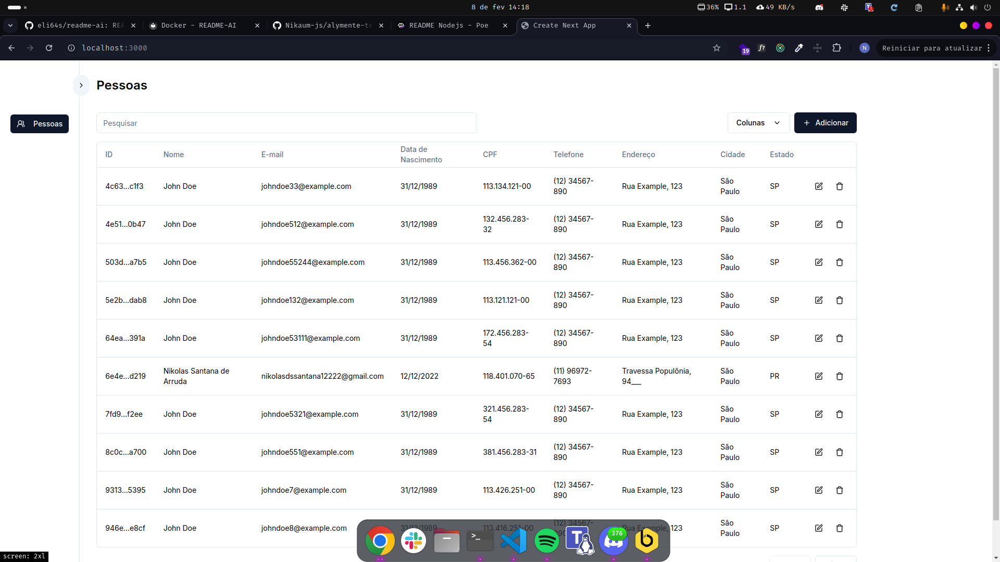

# Alymente Frontend

Interface web moderna desenvolvida com Next.js e React para gerenciamento de pessoas.
  

## 🚀 Tecnologias

- [Next.js 14](https://nextjs.org/)
- [React 18](https://reactjs.org/)
- [TypeScript](https://www.typescriptlang.org/)
- [Tailwind CSS](https://tailwindcss.com/)
- [Radix UI](https://www.radix-ui.com/)
- [React Hook Form](https://react-hook-form.com/)
- [Zod](https://zod.dev/)
- [TanStack Table](https://tanstack.com/table/v8)
- [Axios](https://axios-http.com/)

## ✨ Funcionalidades

- 📋 Listagem de pessoas com paginação
- ➕ Cadastro de nova pessoa
- ✏️ Edição de dados
- 🗑️ Exclusão de registros
- 📱 Interface responsiva
- ✅ Validação de formulários com Zod
- 📊 Tabela de dados interativa

## 🔧 Instalação

1. Clone o repositório:
```bash
git clone https://github.com/Nikaum-js/alymente-test-front-end
cd alymente-front-end
```

2. Instale as dependências:
```bash
npm install
# ou
yarn install
```

3. Inicie o servidor de desenvolvimento:
```bash
npm run dev
# ou
yarn dev
```

O aplicativo estará disponível em `http://localhost:3000`

## 🏗️ Scripts Disponíveis

- `npm run dev`: Inicia o servidor de desenvolvimento
- `npm run build`: Cria a versão de produção
- `npm start`: Inicia o servidor de produção
- `npm run lint`: Executa a verificação de linting

## 📁 Estrutura do Projeto

```
src/
├── app/              # Páginas da aplicação
├── components/       # Componentes reutilizáveis
├── hooks/           # Hooks personalizados
├── lib/             # Configurações e utilitários
└── styles/          # Estilos globais
```

## 🎯 Principais Componentes

### DataTable
- Tabela de dados interativa com paginação
- Ordenação por colunas
- Pesquisa integrada
- Ações por linha (editar/excluir)

### Formulários
- Validação com Zod
- Feedback de erros em tempo real
- Máscaras para campos específicos (CPF, telefone)

### Modais
- Confirmação de exclusão
- Formulários em modal
- Feedback de ações (toast)
